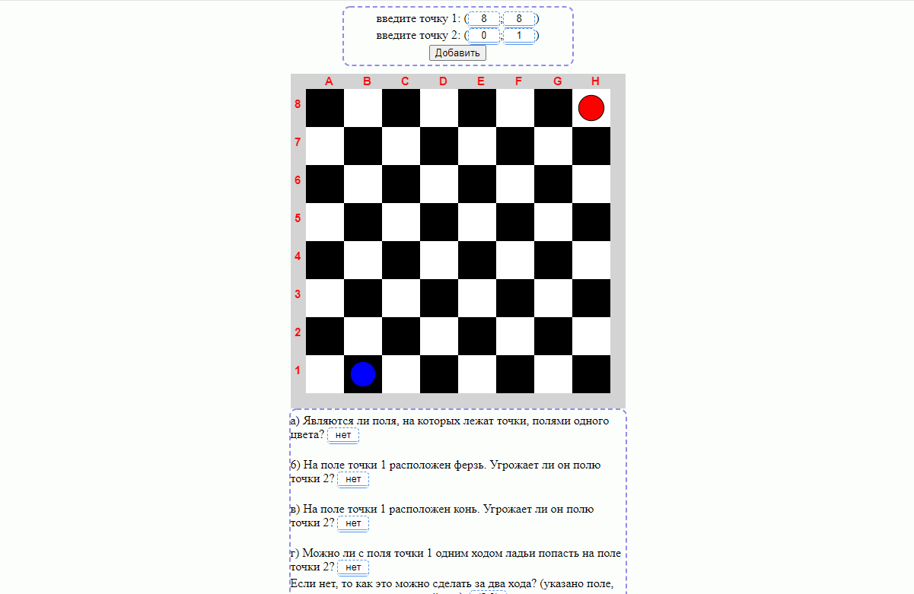

# Описание:
Программа принимает на вход 4 целочисленных значения, а именно - координаты точки 1 (x, y) и координаты точки 2 (x, y), после чего отрисовывает их на шахматном поле и решает задания под ним, как показано на скриншоте:

*Замечатение: Если не вводить координаты, то автоматически будут приняты (1;1) и (2;2) соответственно. То же самое произойдет, если ввести нули!!!*

# Открытие и использование:
* Необходимо открыть файл ___index.html___, чтобы запустить программу. Откроется бразуер, где в новой вкладке будет находиться интерфейс программы, показанный на скриншоте выше. 
*желательно открывать через браузер Google Chrome либо Yandex*

* В самом верху, после слов "Введите точку...", находятся поля, куда и нужно ввести координаты от 1 до 8, включительно. После чего следует нажать на кнопку "Добавить", тогда начнётся отрисовка и решение заданий.

* Снизу, под шахматной доской, находятся задания (вопросы) и соответствующие ответы на них
# Среда программирования: 
Программа построена на чистом JavaScript с использованием разметки html и стилей css. Открывать можно в любом удобном редакторе, который поддерживает данные форматы файлов, для примера, *Visual Code Studio*, *Notepad++* или *блокнот*. Весь пользовательский интерфейс представлен в файле index.html, через него и осуществляется управление программой. Все введенные координаты берутся с интерфейса с помощью js/main.js после нажатия на кнопку "Добавить". Проходят проверку на наличие ошибок, после чего отрисовываются соответствующие точки через js/Graph.js и решаются задания через js/Calc.js. А результаты решений автоматически отобрадаются под доской в соответствующих формах ввода. 
